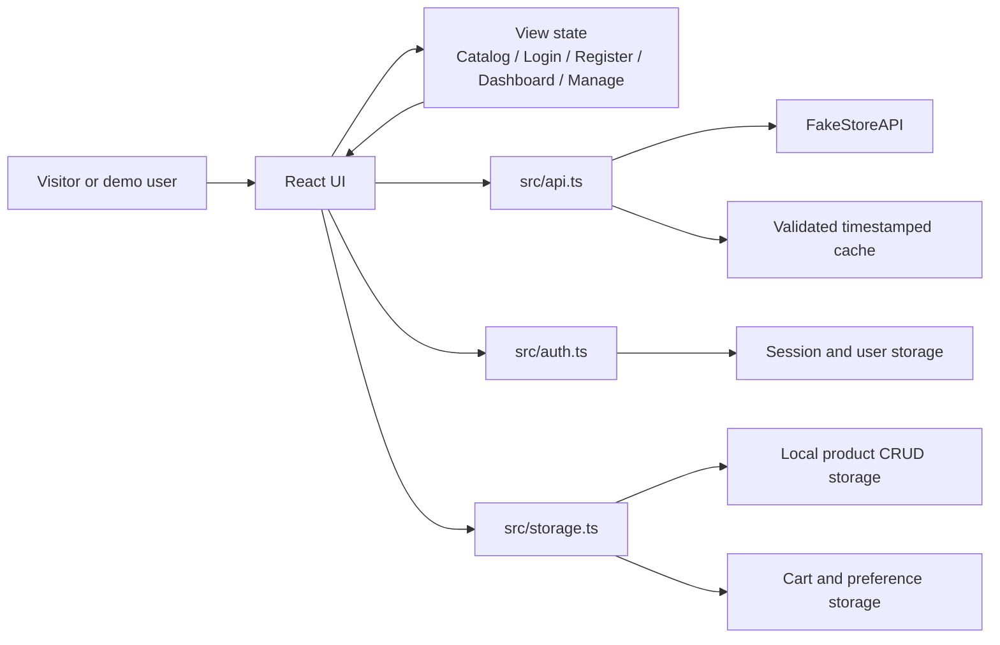

# Aster & Row — Full Stack Interactive Product Catalog

Aster & Row is a polished responsive product discovery and management application built for a Full Stack Web Development capstone. It combines a public FakeStoreAPI catalog with a browser-persistent demonstration account, protected dashboard views, local product CRUD, cart state, resilient loading states, and a production-ready static build.

The authentication and product-management layer is intentionally simulated for education. It demonstrates the application architecture and user flows without claiming to be a secure identity or commerce backend.

## Problem statement and objectives

Product catalogs often need more than a grid of API results: people need to search and filter content, understand a product at a glance, manage their own entries, and return to a consistent session. This project demonstrates those flows in one responsive interface.

The objectives are to:

- Consume and validate a public REST API asynchronously.
- Create a maintainable React + TypeScript frontend with reusable UI patterns.
- Demonstrate login, registration, logout, protected views, and profile context.
- Separate external read-only products from locally managed CRUD products.
- Persist useful state safely in browser storage.
- Handle loading, empty, image, validation, network, and storage failure states.
- Produce a documented, responsive, publicly shareable capstone application.

## Features

### Public catalog

- Products and categories loaded from FakeStoreAPI with `fetch` and `async`/`await`
- Runtime response validation and friendly HTTP/network error states
- In-flight request deduplication
- Timestamped `localStorage` caching with expiry and cached-data fallback
- Live case-insensitive search across names, categories, and descriptions
- Dynamic category filters
- Featured, price, name, and rating sorting
- Product details dialog with image fallback
- Persistent cart with quantity controls, removal, clear, item count, and total
- Light and dark themes
- Loading skeletons, empty states, retry actions, cached-data notices, and feedback toasts

### Demonstration account and dashboard

- Login and registration screens with required-field and email validation
- Password length and confirmation validation
- Duplicate-account prevention
- SHA-256 password hashing before browser persistence; plaintext passwords are not stored
- Persistent demonstration session
- Logout that returns to the public catalog
- Protected dashboard and product-management views
- User name and account context in the navigation
- Dashboard cards for catalog size, owned products, categories, and session status
- Recently created or updated product list and quick actions

### Local product CRUD

- Create products with title, category, price, description, and optional image URL
- Read all products through the catalog and product details dialog
- Edit and validate locally managed products
- Delete with confirmation
- Immediate catalog and dashboard updates without a page reload
- Persistent local products with stable negative IDs to avoid external API collisions
- Clear “Your product” and “Editable” labels so API products are not misrepresented as editable

## Technology stack

- React 19 + TypeScript
- Vite
- Tailwind CSS v4 and CSS custom properties
- TanStack Query provider
- Lucide icons
- Browser Fetch API with `async`/`await`
- FakeStoreAPI
- Browser `localStorage`
- Web Crypto API (`crypto.subtle`) for the simulated password hash

## Architecture overview



External FakeStoreAPI products are read-only in the application. Products created in the management view are stored separately in browser storage and merged into the catalog at read time. This prevents an external API refresh from overwriting user-created data.

## Folder structure

```text
artifacts/product-catalog/
├── public/
│   ├── favicon.svg
│   └── robots.txt
├── screenshots/
├── src/
│   ├── components/
│   │   ├── error-boundary.tsx
│   │   └── ui/
│   ├── hooks/
│   ├── api.ts              # FakeStoreAPI, validation, cache, request dedupe
│   ├── auth.ts             # Demo registration, login, hashing, logout
│   ├── App.tsx             # Views, catalog, cart, dashboard, CRUD UI
│   ├── index.css           # Tokens, responsive styling, states
│   ├── main.tsx
│   └── storage.ts          # Validated localStorage access
├── index.html
├── package.json
├── tsconfig.json
└── vite.config.ts
```

## API endpoints

- `GET https://fakestoreapi.com/products`
- `GET https://fakestoreapi.com/products/categories`

The API layer validates product fields, rating fields, category arrays, HTTP responses, and cache envelopes before rendering data.

## Authentication simulation and limitations

The account flow is for an educational demonstration only:

- Demo credentials: `demo@asterrow.com` / `asterrow-demo`
- Accounts, the session email, and local products remain in the current browser.
- Passwords are hashed with the Web Crypto API before storage, but this is not a substitute for server-side authentication.
- A browser user can inspect or clear their own local storage.
- There is no password reset, email verification, multi-device account sync, authorization server, or production security boundary.
- Do not use this frontend-only authentication for real private data, payments, or production accounts.

## Setup and installation

From a standalone clone:

```bash
npm install
npm run dev
```

For a standalone clone of the public repository:

```bash
npm install
npm run dev
```

The managed Replit artifact supplies `PORT` and `BASE_PATH`. A standalone Vite run defaults to the root path and port 5173.

## Production build

```bash
npm run typecheck
npm run build
```

The production artifact is emitted to `dist/public`. It is a static single-page application and can be served by Replit static deployment, Vercel, Netlify, or Cloudflare Pages. Configure SPA fallback to `index.html` if the host requires it.

## Persistence approach

The app validates every stored value before using it and catches malformed JSON and storage exceptions:

- `atelier-cart.*` stores theme, category, sorting, and cart preferences.
- `atelier-cart.products.v1` and `atelier-cart.categories.v1` store timestamped API cache envelopes.
- `aster-row.users.v1` stores demo user records with password hashes.
- `aster-row.session.v1` stores the active demo email.
- `aster-row.managed-products.v1` stores locally created and edited products.

## Testing checklist

- [x] TypeScript typecheck passes.
- [x] Production Vite build passes.
- [x] FakeStoreAPI products and categories respond successfully.
- [x] API responses and localStorage envelopes are validated.
- [x] Catalog preview loads real products at desktop and mobile sizes.
- [x] Search, category filtering, sorting, details, cart, theme, and cache states are implemented.
- [x] Login and registration validation flows are implemented.
- [x] Demo password hashing and duplicate-account checks are implemented.
- [x] Dashboard statistics derive from loaded and locally managed products.
- [x] Local product create, read, update, delete flows are implemented.
- [x] Local products, session, cart, theme, and filters persist across refreshes.
- [x] Responsive layouts are captured at 320px, 390px, 768px, 1024px, and 1440px.
- [x] Browser preview logs contain no application errors.

## Screenshots

Genuine preview screenshots are stored in `screenshots/`:

- `320-light.jpg`
- `390-dark-capstone.jpg`
- `768-light.jpg`
- `1024-light.jpg`
- `1024-dark.jpg`
- `1440-light.jpg`
- `1440-capstone-catalog.jpg`

## Known limitations and future improvements

- FakeStoreAPI is a demo service and does not provide transactional inventory.
- Local CRUD data is device-local and is not shared across browsers or users.
- Checkout is represented as a next-step interaction; no payment provider or order backend is connected.
- The demo authentication is not suitable for real accounts or sensitive data.
- A future production version should move users and product CRUD to the existing API server with server-side sessions, database constraints, authorization, automated tests, audit history, and a real payment integration.

## Public project

The public source repository is:

<https://github.com/palgirl627-stack/product-discovery-catalog>